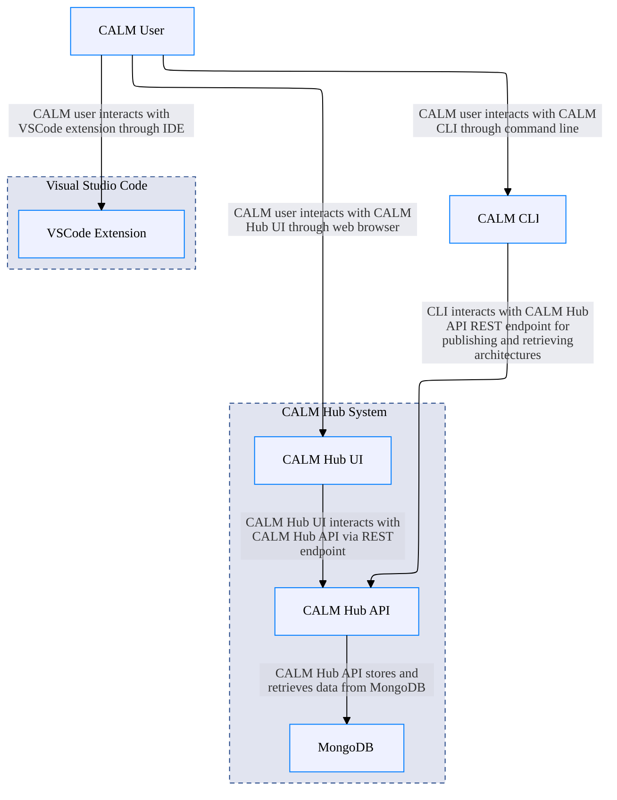

## Architecture Overview

## Nodes

### CALM User
User working with CALM architectures through various tools and interfaces

### CALM CLI
Command-line interface for CALM operations including validation, generation, visualization, and documentation

### VSCode Extension
Visual Studio Code extension providing IDE integration for CALM architectures with syntax highlighting, validation, and visualization

### CALM Hub API
Central registry and API service for CALM architectures, patterns, and standards built with Quarkus

### CALM Hub UI
React-based web interface for browsing and managing CALM architectures, patterns, and standards

### MongoDB
Document database for storing CALM architectures, patterns, and standards in CALM Hub

### CALM Hub System
Complete CALM Hub system including API backend, web UI, and database

### Visual Studio Code
Microsoft Visual Studio Code IDE

