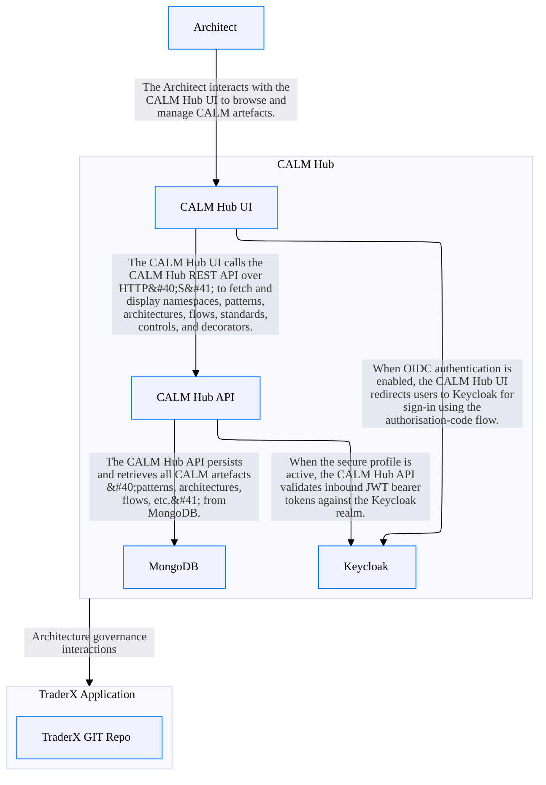

## Architecture Overview

- **name:** CALM Hub Architecture
- **description:** Architecture of the CALM Hub system, comprising a React UI, a Quarkus REST API backend, a MongoDB database, and an optional Keycloak OIDC identity provider.

## Nodes

### CALM Hub UI
React single-page application (Vite) that allows users to browse namespaces, patterns, architectures, flows, standards, controls, and decorators stored in the CALM Hub.

### CALM Hub API
Quarkus JAX-RS REST backend exposing the /calm/** namespace. Serves patterns, architectures, flows, standards, controls, schemas, domains, decorators, ADRs, and user-access resources.

### MongoDB
MongoDB instance used as the primary persistent storage backend for CALM Hub (database: calmSchemas).

### CALM Hub
The CALM Hub system, composed of the UI, API, MongoDB database, and Keycloak identity provider.

### TraderX Application
The TraderX application system, composed of its source code repository and related components.

### TraderX GIT Repo
Git repository hosting the TraderX source code.

### Architect
A human architect who uses the CALM Hub UI to browse, create, and manage CALM artefacts such as patterns, architectures, and flows.

### Keycloak
OIDC identity provider for CALM Hub. Used when the secure profile is enabled; the UI performs OIDC sign-in redirects and the API validates JWT tokens against this realm.

